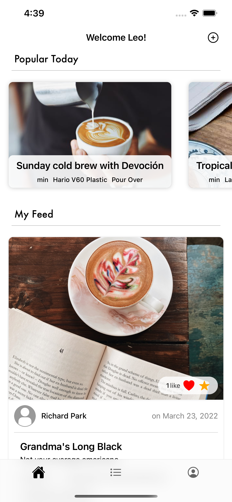
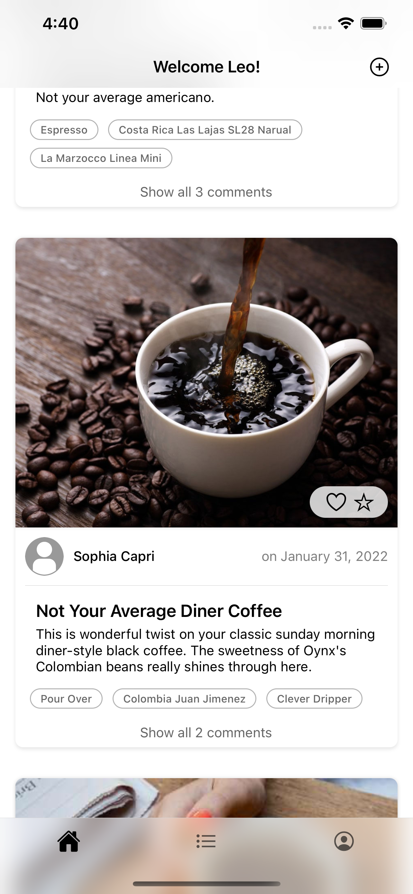
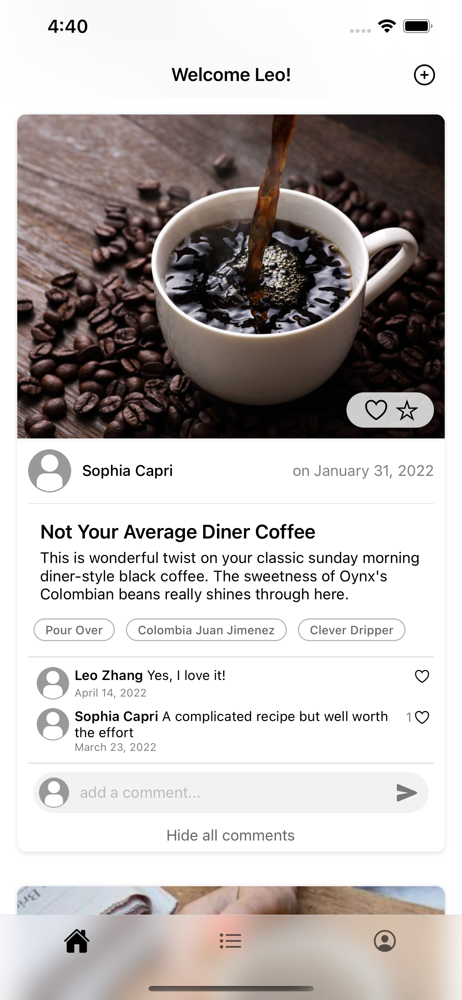
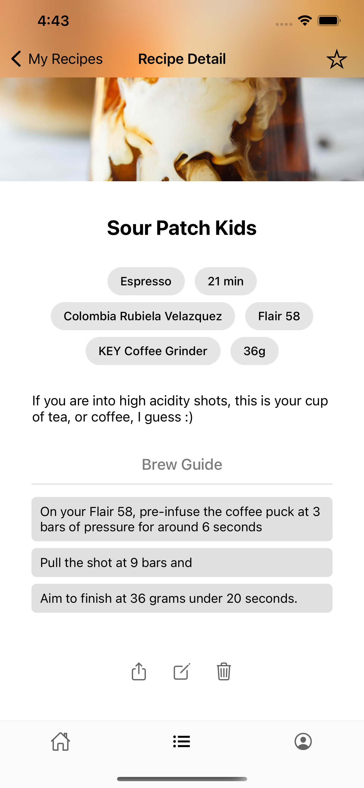
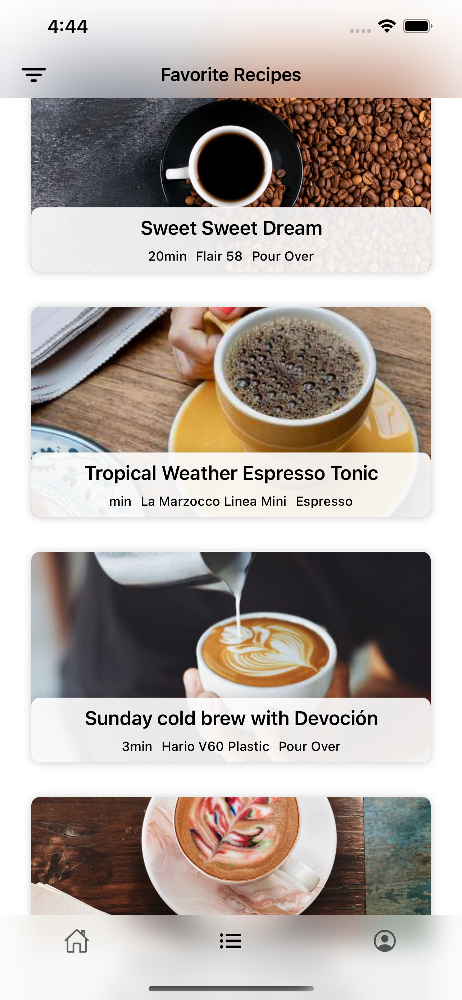
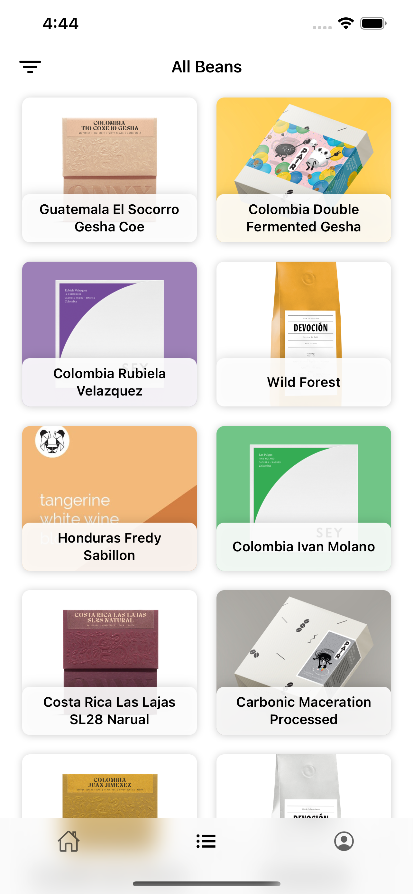
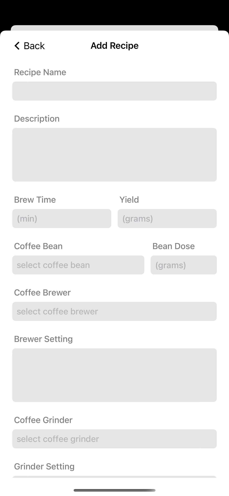
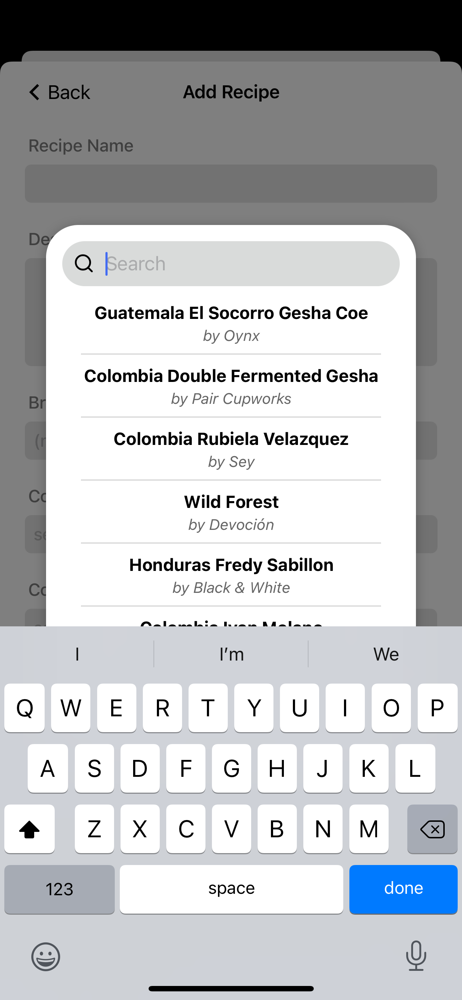
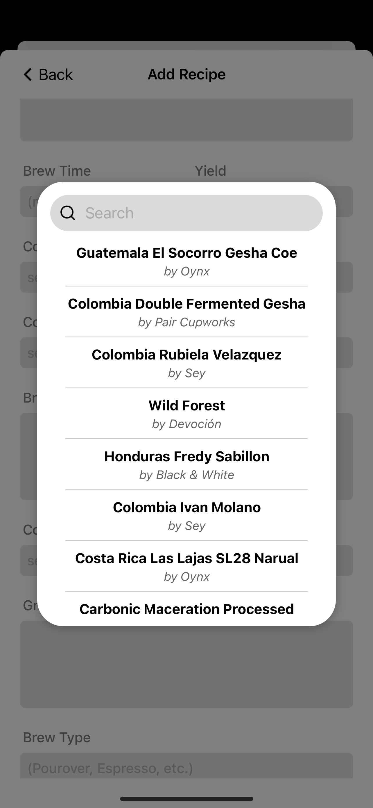

<h1 align="center">BrewLogger</h1>

## Project Description

<strong>BrewLogger is a mobile application and social platform that allows users to create, post, save, comment, like, and share their favorite specialty coffee recipes.</strong>    

## Built With
- Frontend
  - Javascript
  - <strong> React Native </strong>
  - Expo
- Backend ([repo here](https://github.com/leozhvng23/BrewLogger-Backend))
  - <strong> Node.js </strong>
  - Express
  - <strong> PostgreSQL </strong>
  - node-postgres
  - Heroku (backend)
  - AWS RDS (database)

## Screenshots
<!-- 

  
  
  
  
  
  
  
  

 -->
 
 <table>
  <tr>
    <td><strong>Home screen</strong></td>
     <td><strong>Posts on my feed</strong></td>
     <td><strong>Post with comments expanded</strong></td>
  </tr>
  <tr>
    <td></td>
    <td></td>
    <td></td>
  </tr>
 </table>
  <table>
  <tr>
    <td><strong>Recipe detail screen</strong></td>
     <td><strong>Favorite recipes screen</strong></td>
     <td><strong>Recipes by beans screen</strong></td>
  </tr>
  <tr>
    <td></td>
    <td></td>
    <td></td>
  </tr>
 </table>
 <table>
  <tr>
    <td><strong>Create recipe screen</strong></td>
     <td><strong>Select beans modal</strong></td>
    <td><strong>Search function</strong></td>
  </tr>
  <tr>
    <td></td>
    <td></td>
    <td></td>
  </tr>
 </table>

## Author
- [Leo Zhang](https://github.com/leozhvng23 "Leo Zhang")
